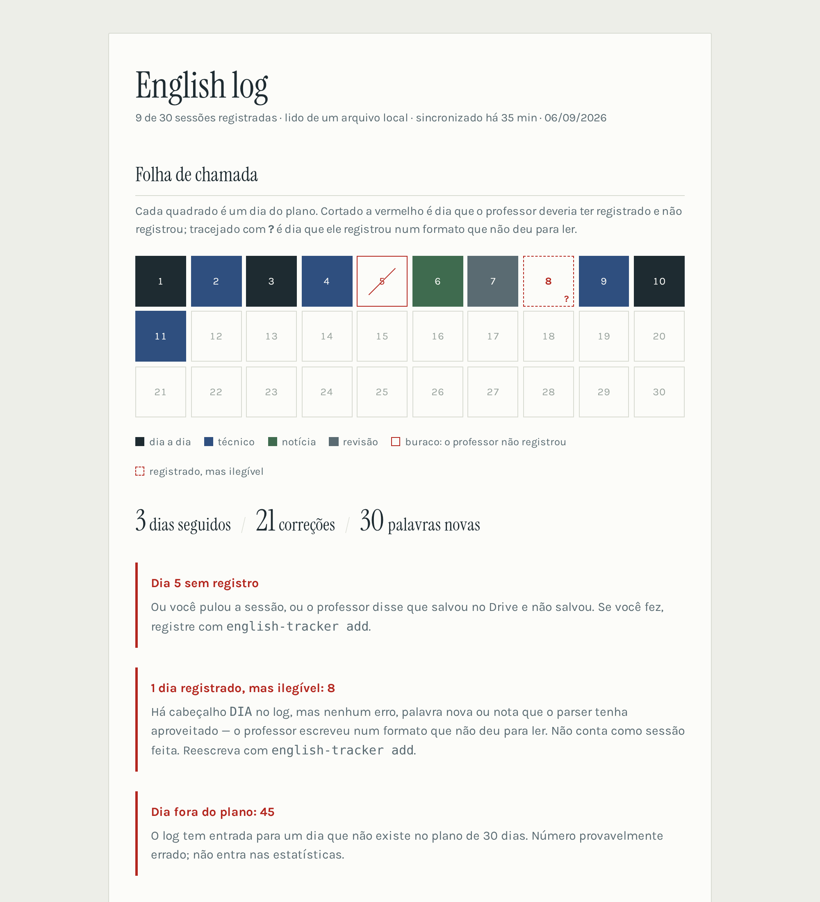
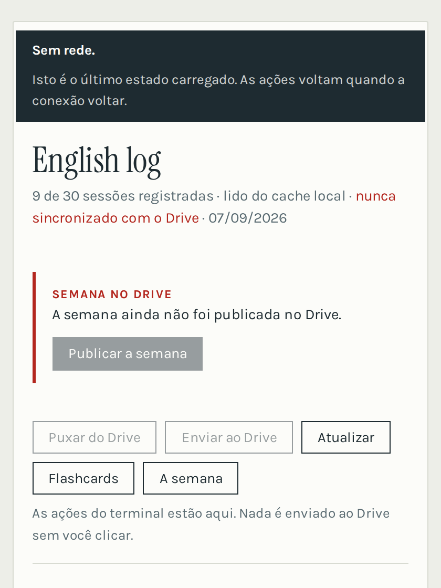

# english-tracker

[](https://github.com/LucasNeiaTorres/en-tracker/actions/workflows/ci.yml)



> **In English, briefly.** A tracker for a 30-day spoken-English plan taught by a
> voice AI. The teacher is asked to append a summary of each session to a file in
> Google Drive — and it silently fails at that, often. So the central design rule
> is that the system never assumes a session was recorded, nor that its content
> was understood: it compares what the plan expected against what is actually in
> the file, and shows the difference. On top of that log it derives a spaced
> repetition schedule (calendar-based, denser intervals for pronunciation),
> generates the next day's prompt, and publishes a week of prompts to Drive so the
> phone works with the laptop turned off. Python 3.10+, four dependencies, 196
> tests, no database.

Painel do plano de inglês de 30 dias. Lê o arquivo `english-log` no Google Drive,
mostra o que está acontecendo e gera o prompt da próxima sessão já com o
histórico embutido.

Quem escreve nesse arquivo é **você**, colando no painel o bloco que o tutor
imprime ao fim da aula — e não o tutor. Verificado em 2026-09-07: o acesso do
Gemini ao Drive é **de leitura**; ele lê e resume, sabe exportar um documento
novo, e não edita arquivo existente. Não é uma permissão que se conceda, é
limite do produto. Por isso o prompt manda **imprimir** o bloco (a instrução
principal, incondicional) e só escrever no Drive se houver ferramenta para
tanto — e por isso o campo de registro é a primeira coisa no painel, não uma
gaveta de exceção.

---

## Contexto: por que isto existe

O plano de estudo (`plano-ingles-30-dias.md`, fora deste
repositório) tem 30 dias de conversa por voz com uma IA que age como professor:
corrige pronúncia e gramática na hora, tem personalidade sarcástica e zoa os
erros de propósito — porque erro com carga emocional gruda mais.

As sessões acontecem no **Gemini Live**, não no Claude, por um motivo técnico:
o Gemini processa áudio de verdade e consegue avaliar pronúncia. Uma interface
que recebe transcrição de texto não consegue — o erro de pronúncia já chega
corrigido.

O plano tem quatro tipos de dia:

| Tipo | Significado | O que acontece na sessão |
|---|---|---|
| `D` | Dia a dia | Conversa cotidiana: pedir comida, viagem, small talk |
| `T` | Técnico | O aluno explica em inglês um conceito que estudou (Spring, mensageria, testes/CI-CD, AWS/Kubernetes) |
| `N` | Notícia | O professor **busca na web** uma notícia de tecnologia recente e interroga o aluno sobre ela |
| `R` | Revisão | Sem tema novo: só treinar os erros que mais se repetem |

**O problema que este software resolve.** O Gemini Live não guarda contexto
confiável entre conversas, e sessão longa faz o modelo relaxar as instruções
(ele para de corrigir e vira bate-papo). A contramedida é: sessão nova e curta
todo dia, com o prompt recolado no início, contendo o histórico. Fazer isso na
mão é chato o bastante pra a pessoa desistir. Este programa automatiza.

---

## A decisão de arquitetura mais importante

**O sistema nunca assume que uma sessão foi registrada.**

Um modelo de linguagem falha em silêncio. Ele diz "salvei no seu Drive" com toda
a convicção do mundo e não salvou nada. Se o painel simplesmente exibisse o que
está no arquivo, o aluno faria dez dias achando que estava tudo registrado e
descobriria três.

Por isso toda análise compara **o que o plano esperava** com **o que existe de
fato no arquivo**. Dia que o plano esperava e o log não tem aparece cortado a
vermelho na folha de chamada, com instrução de como registrar na mão.

A verificação tem **três desfechos, não dois**. Além do dia feito e do buraco
existe o **dia registrado e ilegível**: o professor escreveu algo, o parser não
aproveitou nada, e o dia não pode contar como feito só porque tem um cabeçalho.
Esse é o desfecho que mais engana, porque um dia "feito com zero erros" se lê
como dia limpo — enquanto o buraco, ao menos, aparece em vermelho. Entrada com
zero erros, zero vocabulário e nota vazia é parse falhado, não sessão perfeita:
o prompt exige as três coisas do professor.

Junto vai o **dia fora do plano** (um `DIA 45` digitado errado), que não conta
como sessão e não entra nas estatísticas — antes somava erros e vocabulário sem
aparecer em lugar nenhum.

Se você for estender este projeto: não remova essa verificação e não a
transforme em algo silencioso. É a razão de ele existir.

### Alternativas consideradas e descartadas

| Ideia | Por que não |
|---|---|
| Um sistema puxar o resumo direto da conversa do Gemini | Não existe essa porta. O texto só sai de lá se o próprio Gemini escrever no Drive, ou se a pessoa copiar |
| Usar a Gemini Live API pra construir o tutor de voz do zero | Áudio em tempo real é o caso mais caro da API e o resultado fica pior que o app oficial, que já está pago na assinatura |
| Confiar que o professor sempre escreve no Drive | É exatamente a suposição que quebra sistemas assim. Ver acima |
| Um arquivo novo por sessão no Drive | 30 arquivos soltos são piores de ler e de navegar que um arquivo com entradas empilhadas |

---

## Fluxo completo

```
        ┌──────────────────────────────────────────────┐
        │  english-tracker prompt                      │
        │  gera o prompt do dia com tema + histórico   │
        └───────────────────┬──────────────────────────┘
                            │ copia e cola
                            ▼
        ┌──────────────────────────────────────────────┐
        │  Gemini Live — sessão de voz de 15 min       │
        │  professor corrige, zoa, e ao final tenta    │
        │  escrever o resumo no Drive                  │
        └───────────────────┬──────────────────────────┘
                            │ (pode falhar em silêncio)
                            ▼
        ┌──────────────────────────────────────────────┐
        │  Google Drive: arquivo "english-log"         │
        │  ← FONTE DA VERDADE                          │
        └───────────────────┬──────────────────────────┘
                            │ english-tracker pull
                            ▼
        ┌──────────────────────────────────────────────┐
        │  cache local ~/.english-tracker/             │
        │  parser → analytics → report                 │
        └───────────────────┬──────────────────────────┘
                            │
              ┌─────────────┴─────────────┐
              ▼                           ▼
        status (terminal)          dashboard.html
                                   + prompt do dia seguinte
```

Quando o professor não escreve no Drive, o aluno cola o resumo falado em
`english-tracker add`, que grava localmente e sobe — **fundindo**, nunca
substituindo: entre o último `pull` e o `add` o professor pode ter escrito uma
sessão, e ela não pode ser apagada pela subida.

---

## Repositório e CI

O código não guarda segredo nenhum: credenciais, tokens, senha e o log real vivem
em `~/.english-tracker/`, fora desta árvore. O `.gitignore` é a segunda barreira,
não a primeira.

O CI (`.github/workflows/ci.yml`) roda a cada push: os testes em três versões de
Python, a geração do exemplo de ponta a ponta (`status`, `deck`, `report`) e uma
verificação de que nenhum arquivo de credencial foi versionado — o único erro
deste repositório que um commit seguinte não desfaz.

Para rodar o painel num computador sempre ligado, com deploy puxado do GitHub,
veja `contrib/README.md`.

---

## Instalação

```bash
cd english-tracker
python3 -m venv .venv && source .venv/bin/activate
pip install -e .
```

Requer Python 3.10+. Funciona sem o Drive. O passo a passo completo — subir,
conectar o Drive, a rotina diária e o que fazer quando algo falha — está em
[`COMO-USAR.md`](COMO-USAR.md); as ideias de melhoria do método (não do código)
estão em [`MELHORIAS.md`](MELHORIAS.md). Para ver rodando agora:

```bash
english-tracker --file sample/english-log.md --offline status
english-tracker --file sample/english-log.md --offline report
```

O `sample/english-log.md` tem o dia 5 faltando **de propósito**, pra exercitar a
detecção de buraco. Não "conserte" isso.

Para ver o sistema com o log cheio — buraco, dia ilegível, dia fora do plano,
formatos tortos e uma agenda de revisão povoada:

```bash
python3 sample/gerar-exemplo.py > sample/exemplo-rico.md
english-tracker --file sample/exemplo-rico.md --offline status
english-tracker --file sample/exemplo-rico.md --offline deck
english-tracker --file sample/exemplo-rico.md --offline report
```

É gerador, não arquivo fixo, porque a revisão espaçada usa datas de calendário:
um exemplo com datas cravadas envelheceria e deixaria de mostrar a diferença
entre um item recém-acertado e outro esquecido há um mês.

---

## Conectar o Drive

Uma vez só, uns cinco minutos:

1. [Google Cloud Console](https://console.cloud.google.com) → crie um projeto.
2. **APIs e serviços → Biblioteca** → ative a **Google Drive API**.
3. **Tela de permissão OAuth** → tipo Externo, preencha o mínimo, adicione seu
   e-mail em **Usuários de teste**.
4. **Credenciais → Criar credenciais → ID do cliente OAuth** → **App para
   computador**. Baixe o JSON.
5. Salve em `~/.english-tracker/credentials.json`.

Na primeira execução o navegador abre pedindo autorização **de leitura**
(`drive.readonly`); o token fica em `~/.english-tracker/token.json`. No primeiro
`push` ele abre outra vez, aí pedindo **escrita**, e grava
`~/.english-tracker/token-write.json`. São dois consentimentos porque ler o log
não precisa de permissão para escrever no seu Drive.

```bash
english-tracker pull && english-tracker report
```

---

## Comandos

| Comando | O que faz |
|---|---|
| `status` | Resumo no terminal: sessões, sequência, dias faltando, erros que voltam |
| `report [-o arquivo] [--no-open]` | Gera e abre `dashboard.html` |
| `prompt [--day N] [--curto\|--completo]` | Imprime o prompt pronto para colar. Sem `--day`, usa o próximo dia; o inventário se ajusta ao tamanho do log |
| `add [--day N]` | Registra uma sessão manualmente (lê o resumo do stdin, termina com Ctrl-D) e sobe pro Drive |
| `serve [--porta N] [--sem-abrir]` | **Painel interativo**: sobe um servidor local e as ações viram botões na página |
| `prompt --pacote N [--para-o-drive]` | Gera os próximos N dias de uma vez e, opcionalmente, publica no Drive |
| `deck [--tamanho N]` | **Revisão espaçada do dia**: o que está vencido, para dizer em voz alta fora da sessão |
| `remove --day N` | Apaga um dia do log. **Substitui** o arquivo do Drive, porque remoção não se propaga por fusão |
| `pull` | Baixa o log do Drive para o cache local |
| `push [--force]` | **Funde** o cache local no arquivo do Drive. `--force` substitui o conteúdo remoto em vez de fundir |

Flags globais: `--file CAMINHO` (usar um log local em vez do Drive — no `add`, é
também o **destino da escrita**, e nesse modo o Drive não é tocado) e `--offline`
(não tentar falar com o Drive).

Três coisas que o `add` faz e vale saber:

- Se o texto colado não casar o formato, ele **não é descartado**: vai para o log
  como `Resumo colado` e a tela avisa que erros e palavras não foram extraídos.
- Colar nada não registra nada (antes registrava uma sessão vazia).
- Sem `--file` e sem `--offline`, ele funde no Drive — não sobrescreve.

Variáveis de ambiente:

| Variável | Efeito |
|---|---|
| `ENGLISH_TRACKER_HOME` | Onde ficam token, credenciais e cache. Padrão `~/.english-tracker` |
| `ENGLISH_TRACKER_DRIVE_FILE` | Nome do arquivo procurado no Drive. Padrão `english-log` |
| `ENGLISH_TRACKER_CREDENTIALS` | Caminho do `credentials.json` |
| `ENGLISH_TRACKER_START` | Data de início do plano, formato ISO |
| `ENGLISH_TRACKER_WHATSAPP` | Número do botão "Enviar para o WhatsApp" do painel. Só dígitos, com código do país (`5551999998888`). Vazio: o botão abre o seletor de conversa |

Dentro de `ENGLISH_TRACKER_HOME`:

| Arquivo | Papel |
|---|---|
| `english-log.md` | cache local do log |
| `token.json` | token de **leitura** (`drive.readonly`) |
| `token-write.json` | token de **escrita** (`drive`), pedido só no primeiro `push` |
| `credentials.json` | o OAuth client que você baixou do Google Cloud |
| `file-id` | id do arquivo no Drive, fixado na primeira leitura bem-sucedida |
| `backups/` | cópia datada do conteúdo anterior a cada escrita, dos dois lados |
| `whatsapp` | número do botão do painel, se preferir arquivo à variável de ambiente |
| `service-account.json` | chave da conta de serviço, se usada — não expira e vê só o que foi compartilhado com ela |
| `revisao-local.json` | seus relatos de "errei" e "já revisei hoje" (nunca promovem item) |
| `pacote.json` | quando a semana foi publicada e que dias ela cobre |
| `senha` | senha do painel exposto, se usar `--com-senha` (chmod 600) |
| `last-sync` | carimbo da última leitura efetiva do Drive |

---

## Modo interativo (`serve`)

`report` gera um arquivo estático — ele mostra, não faz. Um HTML aberto em
`file://` não lê o log, não fala com o Drive e não executa Python; para o painel
**agir**, alguém tem de escutar do outro lado. É o que o `serve` faz:

```bash
english-tracker serve          # http://127.0.0.1:8765, abre o navegador
```

A página ganha uma barra com **Puxar do Drive**, **Enviar ao Drive** e
**Atualizar**, mais um formulário de **Registrar sessão à mão**. Cada botão chama
a mesma função que o comando de terminal correspondente, e a página recarrega
depois para refletir o arquivo — não a memória do navegador.

**Pendências.** Antes da barra, o painel lista o que precisa de você — e só o
que precisa. Dois itens hoje:

- **Autorização do Google.** O app fica com status "Em teste", e nesse status o
  Google expira a autorização a cada 7 dias. O painel verifica isso ao carregar
  (uma chamada assíncrona, para não atrasar a página) e, se tiver caído, mostra o
  aviso com o botão **Renovar agora** — que abre a aba de consentimento e, quando
  leitura e escrita caem juntas, refaz as duas em sequência. Descobrir a
  expiração pelo pacote que silenciosamente parou de atualizar seria tarde.
- **Semana no Drive.** Diz se o pacote de prompts ainda serve, decidido só com
  informação local: nunca publicado, esgotado (você passou do último dia coberto)
  ou velho de mais de 7 dias. O botão publica sem sair do painel.

**Puxar do Drive ≠ Atualizar.** O painel renderiza do **cache local**, sem rede:
"Atualizar" só relê o arquivo que está aqui e é instantâneo; "Puxar do Drive" é o
único que vai à rede e traz o que o professor escreveu. Se o carregamento da
página fosse buscar no Drive, os dois botões seriam a mesma coisa e cada
recarregamento pagaria uma ida à rede — por isso o cabeçalho mostra **quando foi
a última sincronização**, que é a informação que falta quando se lê do cache.

**Clicar numa célula da folha de chamada abre o dia**: data, tipo, tema, erros
corrigidos, palavras novas, a nota do professor e — quando houver — o texto que o
parser não interpretou. Os dados vão embutidos na página, então **ver um dia
funciona também no arquivo estático** do `report`. No modo `serve`, o diálogo
traz ainda **Apagar este dia**, em duas etapas: o primeiro clique explica o que
vai acontecer, o segundo executa.

Isto **reintroduz um processo de longa duração**, que é justamente o que o resto
do projeto não tem. É o preço de ter o painel ativo, e por isso o `serve` é
opcional: a CLI continua completa sem ele, e o `report` continua gerando um
arquivo inerte, que você pode guardar ou mandar por e-mail sem botões que não
funcionariam.

### Instalar no celular, e usar offline

O painel é uma PWA: com HTTPS, o navegador oferece "adicionar à tela inicial" e
ele passa a abrir em tela cheia, com ícone próprio — e **abre sem rede**,
mostrando o último estado carregado.



O HTTPS não é detalhe: navegador **só registra service worker em contexto
seguro**, e pelo IP da rede em HTTP puro ele é ignorado em silêncio. O caminho
curto é `tailscale serve --https=443 localhost:8765`.

Quatro decisões dentro disso:

**Rede primeiro, cache como reserva.** O painel mostra estado que muda; servir
cache primeiro exibiria número velho com cara de atual — a mentira que este
projeto evita em todo lugar. Offline, cai para a última versão carregada.

**A detecção de offline mede, não confia.** `navigator.onLine` diz "existe
interface de rede", não "o servidor responde" — verificado: ela continua `true`
com a rede desligada. Então a página faz um `GET /api/ping`, que o service worker
não intercepta (nada sob `/api/` é cacheado), e mede de novo ao voltar para o app
— que no celular é o caso comum.

**Offline, só as ações travam.** "Puxar do Drive", "Enviar ao Drive" e
"Publicar a semana" ficam desabilitadas, com o motivo no `title`. Navegação
(Flashcards, A semana, Atualizar) continua livre, porque essas páginas estão em
cache e abrem — travá-las bloquearia o que funciona.

**"Sem rede" e "o servidor quebrou" não são a mesma coisa.** Servidor
desligado: a conexão falha, o `fetch` rejeita, o cache entra. Servidor ligado
com o serviço do painel caído: o proxy responde 502, o `fetch` **resolve**, e o
tratamento de falha nunca dispara — a versão anterior mostrava "502 Bad Gateway"
com o painel inteiro sentado no cache do lado. Medido num navegador de verdade,
não deduzido. Agora um 5xx em navegação também cai para o cache, e o aviso no
topo diz qual dos dois é: esperar resolve um e não resolve o outro.

### Ver o painel de outro computador

O padrão é `127.0.0.1`: só esta máquina alcança. Para ver de outro lugar existem
`--host` e `--somente-leitura`, mas antes vale entender **o que o token não faz**.

Ele é servido **dentro da própria página**. Isso o torna eficaz contra o que ele
foi feito para impedir — outra aba do navegador, ou um processo local qualquer,
disparando ações às escondidas. E o torna inútil contra quem consegue *carregar*
a página: essa pessoa recebe o token junto. Como os endpoints escrevem no Drive,
**publicar o painel na internet aberta é dar escrita no seu Drive a quem achar a
URL** — sem autenticação de verdade na frente, nenhum túnel público serve.

O caminho que funciona é **rede privada**, não internet:

```bash
# rede privada (Tailscale, VPN, LAN de casa), com a trava do modo leitura
english-tracker serve --host 0.0.0.0 --host-extra note.seu-tailnet.ts.net --somente-leitura
```

- `--host` diz onde ouvir. Sair de loopback imprime um aviso explícito na
  partida — e o aviso vai com `flush`, porque aviso que fica no buffer não é
  aviso.
- `--host-extra` acrescenta nomes aceitos no cabeçalho `Host`. A checagem
  continua valendo fora de loopback: é a defesa contra um site externo resolver
  um domínio para o seu IP privado. Hosts terminados em **`.ts.net`** (Tailscale)
  são aceitos sem configuração — nomes desse espaço resolvem só dentro do seu
  tailnet, e portanto não servem ao ataque que a checagem barra.
- `--somente-leitura` mostra o painel inteiro e **recusa toda rota que muda
  algo** — log, Drive e autorização. É a trava certa para o acesso remoto: ver de
  qualquer lugar, agir só onde o log e o token moram.

#### Com senha, na internet

Dá para expor publicamente **se houver autenticação de verdade na frente** — e a
pergunta que decide a segurança é de quem é essa autenticação.

O `serve` tem uma camada própria:

```bash
printf 'uma-senha-longa' > ~/.english-tracker/senha && chmod 600 ~/.english-tracker/senha
english-tracker serve --host 0.0.0.0 --com-senha --somente-leitura
```

É um **formulário de login com sessão em cookie**, e a razão de não ser HTTP
Basic é concreta: app instalado na tela inicial do iOS não exibe o diálogo nativo
de credencial — ele renderiza o corpo do 401, e o usuário fica olhando uma frase
sem campo e sem botão. Formulário é HTML comum, aparece em qualquer contexto que
saiba mostrar página. Basic continua aceito para a linha de comando
(`curl -u :senha`), só deixou de ser o único caminho.

A sessão vale 90 dias, mora na memória do processo (reiniciar o serviço desloga),
e o cookie vai `HttpOnly`, `SameSite=Lax` e `Secure` quando a requisição chega por
HTTPS — nunca `Secure` em HTTP puro, senão o navegador descartaria o cookie na
LAN e o login pareceria quebrado. `GET /sair` encerra a sessão no servidor, não só
no navegador.

A senha **nunca vem por argumento**: sai de
`ENGLISH_TRACKER_SENHA` ou de `~/.english-tracker/senha`, porque argv aparece no
`ps` de qualquer processo da máquina e fica no histórico do shell. Há freio de
força bruta: dez erros em cinco minutos e a origem trava, porque painel exposto é
varrido por robô em horas.

**Mas essa senha não deve ser a primeira tranca, por duas razões.** Em HTTP puro
ela trafega legível — só protege de verdade sobre HTTPS. E é código caseiro de
autenticação num endpoint que dá escrita no seu Drive: qualquer falha ali entrega
tudo.

O arranjo que eu recomendaria é **Cloudflare Tunnel + Cloudflare Access**, os
dois gratuitos: o túnel dá HTTPS e dispensa abrir porta no roteador; o Access põe
**login com a sua conta Google** na frente, com o MFA que você já usa. Assim a
autenticação é de quem faz isso profissionalmente, e a senha do `--com-senha`
vira o que ela deve ser — a segunda tranca, para o caso de a primeira estar mal
configurada. Com `--somente-leitura` junto, mesmo um furo nas duas não muda nada
no seu log.

**Hospedagem gratuita não resolve isto**, por três razões, e a primeira é
definitiva: o fluxo OAuth deste programa é de aplicativo de desktop — ele abre um
navegador **na máquina que roda o servidor**. Num servidor remoto não há
navegador, e como a autorização expira a cada 7 dias (status "Em teste"), não
haveria como renová-la. Somam-se o disco efêmero das camadas gratuitas, que
apagaria o cache e os tokens a cada reinício, e o fato de que subir
`credentials.json` com escopo de escrita no Drive para a máquina de terceiros é
trocar conveniência por risco.

Três decisões de segurança, porque estes endpoints escrevem no seu Drive:

- **Escuta só em `127.0.0.1`** — nunca `0.0.0.0`. Ninguém na rede alcança.
- **Token por execução**, gerado a cada `serve`, embutido na página e exigido em
  toda chamada de API. Sem ele, qualquer página aberta no seu navegador poderia
  disparar uma escrita no seu Drive.
- **Checagem do `Host`** — requisição com outro host é recusada. É a defesa
  contra DNS rebinding, em que um site externo resolve um domínio para
  127.0.0.1 e passa a conversar com o servidor local.

Sem dependência nova: `http.server` da biblioteca padrão.

---

## Contrato de dados

Este é o formato que o prompt gerado pede ao professor, e o que
`render_entry()` produz:

```
DIA 07 — 09/09 — Tipo: T — Tema: idempotência e dead letter queue
Erros: [pron] queue; [gram] "depends of" → "depends on"; [flu] travei em "prejudicar"
Acertos: [pron] architecture; [gram] ordem de adjetivos
Palavras novas: at-least-once, to retry, backoff
Reusou: trade-off, to roll out
Nota do professor: "Your grammar has a dead letter queue too."
```

**A seta e o igual são separadores, não texto:** o que vem depois de `→` num erro
(ou de `=` numa palavra) é a **forma certa / frase-modelo / gloss**, e é isso que
vira o **verso do flashcard**. O rótulo do item é só o lado esquerdo. Quem escreve
o lado direito é o professor, na sessão: um programa que inventasse a correção —
ou a pronúncia de `queue` — estaria dando exatamente o palpite que este projeto
existe para não dar. O que faltar, você preenche pela tela de cartões.

**A etiqueta de classe** (`[pron]`, `[gram]`, `[lex]`, `[flu]`) é opcional e
muda o cronograma: erro de **pronúncia** recebe intervalos mais curtos que os
demais. Ela sai do rótulo na leitura — o item continua sendo "queue", não
"[pron] queue" —, e o log **antigo, sem etiqueta, continua classificado** por
pista no texto: `pronúncia de "architecture"` é pronúncia, `travei em "x"` é
fluência. Ampliar o parser, nunca substituir.

**`Acertos` e `Reusou` não são enfeite: são o sinal positivo da agenda de
revisão.** `Acertos` é só para o que o aluno **errava antes e acertou hoje**, e
`Reusou` só para palavra de sessão **anterior** que ele usou sem ser mandado.
Sem elas, o log seria um registro exclusivamente de fracasso, e a repetição
espaçada só saberia que um erro *não* reapareceu — e "não errei" não é o mesmo
que "acertei". As duas linhas são opcionais no arquivo: aparecem quando há o que
registrar.

Regras do parser (`parser.py`). Quem escreve o arquivo é **outra IA**, então o
parser não lê um formato: lê a *tentativa* de um formato. Ele separa duas classes
de variação e trata cada uma de um jeito.

**Formatação — absorvida em silêncio, é ruído:**

- Toda linha que comece com `DIA n` / `DAY n` inicia uma entrada. **Só o número
  é exigido**; data, tipo e tema são *procurados* no resto da linha, em qualquer
  ordem. Cabeçalho que não casava por inteiro fazia a entrada desaparecer — e a
  linha `Erros:` dela sobrescrever os erros do dia anterior.
- Decoração markdown é removida antes de qualquer coisa: `**DIA 07 ...**`,
  `## DIA 07 ...`, `- DIA 07 ...`, `> DIA 07 ...`, `**Erros:** a; b`.
- Rótulos nas duas línguas: `Erros`/`Errors`/`Mistakes`,
  `Palavras novas`/`Vocabulário`/`Vocabulary`/`New words`/`Words`,
  `Acertos`/`Acerto`/`Got right`/`Right`/`Wins`/`Melhorou`,
  `Reusou`/`Reutilizou`/`Reused`/`Used again`,
  `Nota do professor`/`Nota`/`Teacher's note`/`Rating`/`Note`/`Avaliação`.
- Separadores: travessão, meia-risca, hífen, igual ou dois-pontos. Ausência
  também é aceita (`DIA 12` sozinho).
- Tipo abreviado ou por extenso, nas duas línguas: `T`, `Técnico`, `Tech`,
  `Technical` (ver `KIND_WORDS`).
- Data com ou sem ano, com ou sem parênteses; sem ano assume o ano corrente.
  Data ausente é aceita.
- Erros separados por `;`, `|` ou `•`; vocabulário por `,` ou `;`. **Ou em
  lista** — bullet (`-`, `*`, `•`) ou numerada (`1.`, `2)`) nas linhas abaixo do
  rótulo, que é como um modelo que escreve markdown quase sempre faz. Antes essas
  linhas eram ignoradas e o dia entrava com zero erros.
- Placeholder do próprio molde (`<mistake>`, `<word>`, `<one line>`) é
  descartado: se o professor copiar o gabarito ao pé da letra, isso não é erro do
  aluno.
- Travessão e hífen sozinhos (`Erros: —`) valem como "não tenho isto".
- Linhas não reconhecidas não entram na análise, mas **não são jogadas fora**:
  ficam em `Entry.extra` e voltam para o arquivo no `render_entry`. O modelo
  sempre adiciona preâmbulo educado que ninguém pediu.
- Dia repetido: a **última** entrada vence.

**Estrutura — nunca absorvida em silêncio:**

- Entrada sem nada aproveitável (zero erros, zero vocabulário, nota vazia) recebe
  `status = "sem-conteudo"`, não conta como sessão feita e aparece no painel como
  *registrado, mas ilegível*.
- Dia fora de 1..30 fica em `Report.unknown_days`, não conta como sessão e não
  entra nas estatísticas.

`normalize()` é o que faz o agrupamento de erros funcionar: remove acento,
maiúscula, pontuação e espaço duplicado. `'Pronúncia de "architecture"'` e
`'pronuncia de architecture'` caem no mesmo balde.

---

## Modelo de dados

```
PlanDay   (plan.py)      day, kind (D/T/N/R), topic, week, track
Entry     (parser.py)    day, when, kind, topic, errors[], vocab[], note, raw,
                         extra (o que não foi entendido), status (ok |
                         sem-conteudo), has_content, ok
ErrorGroup(analytics.py) label, count, days[]
VocabItem (analytics.py) word, first_day, times
Report    (analytics.py) agregado completo — é o que o template consome
```

`Report` carrega: `done_days`, `missing_days`, **`illegible_days`**,
**`unknown_days`**, `next_day`, `current_streak`, `longest_streak`,
`completion`, `by_kind`, `top_errors`, `error_themes`, `vocab`,
`errors_per_day`, `total_errors`, **`revisao`**, **`dominados`**, **`por_classe`**,
`generated_at`, mais as propriedades `total_sessions`, `vocab_count`,
`has_gaps`, `has_anomalies` e **`vencidos`**.

As estatísticas saem **só das entradas aproveitáveis** — dia no plano e com
conteúdo. Anomalia não entra na média: aparece.

Detalhe de comportamento: `next_day` é o **primeiro buraco**, não o dia seguinte
ao último feito. Se o dia 3 ficou pra trás e o 4 foi feito, o próximo é o 3.

---

## Revisão espaçada

O plano tem cinco dias de revisão (7, 14, 21, 28, 30) — 17% dele. Isso não basta
para fixar nada: quatro recuperações em trinta dias é menos do que qualquer curva
de esquecimento tolera, e o vocabulário não era revisado **nunca**. Daí a
agenda, que é uma camada diária de dois minutos, fora da sessão.

**Ela não tem banco de dados: é derivada do log.** O arquivo já diz, para cada
item, quando ele apareceu e o que aconteceu com ele:

| No log | Significa | Efeito na agenda |
|---|---|---|
| item em `Erros:` | falha | volta para a primeira caixa |
| item em `Acertos:` | acerto | avança uma caixa |
| palavra em `Palavras novas:` | entrou | primeira caixa |
| palavra em `Reusou:` | acerto | avança uma caixa |

Intervalos, em **dias de calendário** (é aqui que o `Entry.when` finalmente
serve): `1, 3, 7, 16, 30` — e **`1, 2, 5, 10, 21` para pronúncia**, que decai
mais rápido porque é motor, não regra: articulação sem prática recente volta ao
padrão do português. Item que sobrevive à última caixa sem reaparecer como erro
sai da fila e entra em **Dominados** — que é a única medida de progresso do
painel: não o que você fez, o que deixou de errar.

**Ausência não promove.** Um erro que simplesmente não voltou continua na fila,
porque silêncio não é evidência: pode ser que você tenha acertado, pode ser que
tenha desviado do assunto. O que promove é o professor registrar `Acertos:`.

Consequência prática: **a agenda avança na sessão, não no `deck`.** Dizer as
frases em voz alta é a prática; o registro do acerto vem do professor, no
próximo diálogo. Se o `deck` marcasse o item como revisado sozinho, o sistema
estaria acreditando na sua palavra sobre o seu próprio inglês — que é
exatamente o tipo de confiança que este projeto não pratica.

```bash
english-tracker deck              # os 5 mais atrasados
english-tracker deck --tamanho 3
```

A fila pode ficar longa (nos primeiros dias, tudo está vencido). O `deck` corta
em cinco de propósito: fila longa não se revisa. E reserva **até três vagas para
pronúncia**: o passivo de vocabulário cresce umas quatro palavras por
sessão e, por atraso bruto, empurraria as duas classes de tolerância zero para
fora da lista.

### Dois regimes de tolerância zero

O prompt não tem "a regra mais dura": tem **dois regimes**, com procedimentos
diferentes e uma regra de desempate. Isso é deliberado — dois superlativos
concorrentes ("isto é o mais importante", "aquilo também") fazem o modelo escolher
um arbitrariamente. A separação é honesta porque os problemas são de naturezas
distintas: **gramática é regra, pronúncia é motor.**

**Desempate, quando os dois ocorrem na mesma frase: gramática primeiro.**
Concordância errada ou palavra errada mudam o que foi dito; sotaque forte custa
uma repetição. O prompt manda voltar à pronúncia antes de trocar de assunto, para
ela não ser silenciosamente descartada.

**Gramática e significado** — procedimento: parar no erro; **nomear a regra em uma
linha**, não dar aula; fazer o **aluno produzir** a frase corrigida (não repetir
depois do professor, porque repetir não ensina regra); e então fazer produzir uma
**segunda frase diferente** com a mesma regra, para saber que não foi sorte. Erro
repetido na mesma sessão vira três frases. Em palavra errada, a ordem é dizer **o
que a palavra que o aluno usou significa de verdade** antes de dar a certa — quebrar
o mapeamento errado vale mais que a correção ("você disse 'pretend', que é
'fingir'; você queria 'intend'").

Inventário: concordância sujeito-verbo (o `-s` da terceira pessoa, o erro nº 1 do
log), **incontáveis** que estão em todo o vocabulário de trabalho (information,
advice, feedback, software, equipment), regência de preposição (depend **on**),
artigos, present perfect versus passado simples, `do`-support, colocações
traduzidas ao pé da letra ("make a question" → ask), e **20 falsos cognatos** —
actually, eventually, pretend, realize, support, assist, attend, comprehensive,
sensible, library, parents, college, push, notice, prejudice, policy, fabric,
lunch, resume, costume.

**Pronúncia** — o que está escrito lá, e por quê:

- **Parar na hora**, não no fim da frase; e a proibição explícita de "close
  enough", "good enough", "almost" e "I know what you mean". Modelo de voz é
  complacente por construção: ele entende a palavra pelo contexto e segue. Ser
  inteligível não é a régua.
- **Procedimento fixo**: palavra isolada e exagerada → o que a boca fez de errado
  em uma frase → repetir 3 vezes → refazer a frase inteira. Errar a mesma palavra
  duas vezes na sessão vira 5 repetições e menção em voz alta.
- **Inventário de brasileiro**, item por item: epêntese ("helpi", "estart"),
  `-ed`/`-s` finais, /θ/ e /ð/, /ɪ/ vs /iː/, /æ/ vs /ɛ/, /h/ e /r/ iniciais,
  **acento tonal** (o que torna a fala inintelegível mesmo com todos os sons
  certos), letras mudas, e a lista de termos técnicos que ele diz no trabalho
  (`queue`, `cache`, `schema`, `tuple`, `route`, `query`, `idempotent`…).
- **Auto-checagem no minuto 8**: quantas correções de pronúncia já fez. Se for
  zero, está sendo mole.
- E o registro etiquetado, para o rigor ser **medido** e não só declarado: a
  seção "Onde o inglês falha" do painel conta as correções por classe.

### A semana (`/semana`) — para não precisar do notebook todo dia

O prompt de um dia **só muda quando o log muda**. Isso significa que ele pode ser
preparado com antecedência: gera-se a semana quando a máquina está à mão, e o
celular consome depois, sozinho.

```bash
english-tracker prompt --pacote 7                    # imprime os 7 próximos
english-tracker prompt --pacote 7 --para-o-drive     # publica no Drive
```

O arquivo tem **duas coisas**: a **revisão** do dia (os itens vencidos, com o
verso quando existe, agrupados por classe) e os **prompts** de cada dia. A
revisão vai junto de propósito: o painel e o `deck` são melhores — têm os botões
de "errei" e "já revisei" —, mas nenhum dos dois funciona com o notebook
desligado, e a revisão é a parte do método que mais sofre com interrupção. Ela
usa a mesma seleção do `deck`, com as vagas reservadas para gramática e
pronúncia.

O `--para-o-drive` escreve `english-prompt.md` — **arquivo separado do log**, que
é gerado e descartável. Ainda assim a escrita é guardada: se o alvo existir e não
começar com a marca `PROMPTS DOS DIAS`, é recusada, porque um arquivo de nome
parecido pode ser outra coisa. No celular, você abre pelo app do Drive e copia o
bloco do dia.

A página `/semana` faz o mesmo pela interface, com um **botão de WhatsApp por
dia** (o pacote inteiro tem ~60 KB e não caberia numa URL só) e o botão de
publicar no Drive.

**O que envelhece, e está escrito no cabeçalho do pacote:** o tema de cada dia
está sempre certo, porque é o plano. O histórico e a lista de revisão dentro de
cada bloco são do momento da geração — quanto mais tempo passar, mais velhos. O
pacote diz isso e manda regenerar quando houver notebook.

Para não depender nem de lembrar: `contrib/` traz um timer do systemd que puxa o
log e republica o pacote de hora em hora, enquanto a máquina estiver ligada. O
que o derruba é a expiração de 7 dias do token do Google — documentada em
`contrib/README.md`, com o sintoma e o diagnóstico.

### Flashcards (`/cards`)

No modo `serve`, o botão **Flashcards** abre uma tela dedicada com os itens
vencidos: frente com o item e a tarefa (que muda por classe — pronúncia pede a
palavra 3x, gramática pede uma frase e depois outra), verso com a forma certa e o
contexto (em que dias apareceu, em que sessões, a nota do professor).

Três botões, e a assimetria entre eles é deliberada:

| Botão | O que faz na agenda |
|---|---|
| **Errei** | Rebaixa o item: volta amanhã. Autorrelato de falha é confiável — ninguém alega errar sem ter errado |
| **Já revisei hoje** | Tira do baralho **do dia** e **não mexe na caixa**. Prática não é evidência: quem promove é o `Acertos:` do professor |
| **Próximo / Pular** | Nada. Só avança |

**Nenhum botão promove item.** Autorrelato de acerto — sobre a sua própria
pronúncia, justamente — é o que este sistema não aceita, pela mesma razão que não
aceita o "salvei no seu Drive" de um modelo. Os relatos vivem em
`~/.english-tracker/revisao-local.json` e caducam em 120 dias.

**Cartão sem verso diz isso na cara** e oferece um campo para você escrever. O que
você escreve vai **para o log**, não para um arquivo à parte — o log é a fonte da
verdade e é ele que sobe para o Drive; anotação local se perderia na troca de
máquina. Verso escrito pelo professor nunca é sobrescrito.

### O inventário encolhe sozinho

Os dois inventários somam uns 5.000 caracteres, e o prompt completo passou de
~3.000 para **~11.400**. Isso é problema, não conquista: instrução longa dilui
instrução. Mas o inventário genérico é **material de ensino para o modelo**, e
vale só enquanto o log está vazio — depois, quem sabe dos erros do aluno é o log.

Então ele se troca: até a quinta sessão registrada, vai o inventário genérico
completo; a partir daí, vai o **personalizado**, com os erros de fato cometidos,
por classe, mais uma linha curta lembrando as categorias. No exemplo de 9 sessões
o prompt cai de 11.400 para **7.900 caracteres** e fica mais específico, não menos.

```bash
english-tracker prompt              # automático
english-tracker prompt --curto      # força o personalizado
english-tracker prompt --completo   # força o genérico inteiro
```

Se for cortar mais, corte do inventário — nunca dos procedimentos nem do
desempate.

---

## Estrutura

```
english_tracker/
  plan.py        os 30 dias e as 4 trilhas técnicas, como dado
  parser.py      lê o english-log e transforma em Entry
  analytics.py   sequência, buracos, erros recorrentes, vocabulário, agenda de revisão
  prompt.py      monta o prompt do professor com histórico e erros recorrentes
  drive.py       Google Drive: alvo fixo, fusão em vez de sobrescrita, backup
  report.py      renderiza o painel
  server.py      modo interativo: as ações da CLI expostas em HTTP local
  cli.py         linha de comando
  templates/
    dashboard.html   o painel: folha de chamada, revisão, erros, próxima sessão
    cards.html       a tela de flashcards, com verso e os três botões
  static/
    manifest.json  a PWA: nome, ícones, tela cheia
    sw.js          service worker: rede primeiro, cache como reserva
    icon-*.png     o ícone (a célula da folha de chamada, riscada)
    semana.html      os próximos dias, para levar ao celular
contrib/         timer do systemd que publica o pacote sozinho
tests/
  test_parser.py             formato canônico e tolerâncias documentadas
  test_formatos_do_modelo.py o que a outra IA realmente escreve
  test_analytics.py          buracos, sequência, prompt, determinismo
  test_drive.py              fusão e backup
  test_cli.py                o add e o destino da escrita
sample/
  english-log.md       log mínimo, com um buraco proposital (dia 5)
  gerar-exemplo.py     gera um log COMPLETO com datas relativas a hoje
  exemplo-rico.md      a saída dele: 11 sessões, todos os estados, agenda cheia
```

---

## Design do painel

A metáfora é uma **folha de exercício corrigida a caneta vermelha**, porque é
literalmente o que o sistema faz. Se for mexer no visual, mantenha a coerência:

| Token | Valor | Papel |
|---|---|---|
| `--paper` | `#EDEEE8` | fundo da mesa |
| `--sheet` | `#FCFCF9` | a folha |
| `--ink` | `#1E2B31` | texto do aluno |
| `--pencil` | `#5A6B72` | texto secundário |
| `--pen` | `#B3261E` | **caneta do professor**: erros, buracos, ilegíveis, notas |
| `--tech` | `#2F4F7F` | caneta azul do aluno: dias técnicos |
| `--grow` | `#3F6B4F` | dias de notícia |

O vermelho é **só** do professor. O dia técnico usava `--pen` e criava uma
ambiguidade na folha de chamada: célula vermelha cheia (técnico feito) ao lado de
célula vermelha cortada (buraco). Daí a caneta azul.

Tipografia: Instrument Serif (títulos e números) + Karla (corpo). As notas do
professor aparecem em serifa itálica vermelha, como anotação na margem.

A seção **Próxima sessão** é o que se usa todo dia: traz o prompt pronto e dois
botões. **Enviar para o WhatsApp** monta um link `wa.me` com o prompt já
codificado e abre o WhatsApp (Web no desktop, app no telefone) com o texto
digitado — nada é enviado sem você apertar enviar; é link de conversa, não API do
WhatsApp. Sem número configurado, ele abre o seletor de conversa, onde fica
"Conversar comigo mesmo". Existe porque **a sessão acontece no celular e o painel
roda no notebook**: sem isso, o loop diário depende de copiar 3 mil caracteres
entre dispositivos, que é a fricção que derruba hábito diário.

O herói da página é a **folha de chamada**: 30 células numeradas. A numeração
se justifica aqui porque o conteúdo é de fato uma sequência. Célula preenchida =
feito, cor indica o tipo do dia; célula cortada em vermelho = buraco; célula com
borda tracejada vermelha e `?` = registrado, mas ilegível; círculo vermelho =
próximo dia.

---

## Testes

```bash
pip install -e ".[dev]"
python -m pytest tests/ -q
```

179 testes, em nove arquivos:

| Arquivo | O que protege |
|---|---|
| `test_parser.py` | o formato canônico e as tolerâncias documentadas |
| `test_formatos_do_modelo.py` | as formas que a **outra IA** realmente escreve: cabeçalho torto, bullet, negrito, placeholder, entrada vazia, dia fora do plano |
| `test_analytics.py` | buraco, sequência, agrupamento, prompt, determinismo do painel |
| `test_drive.py` | a fusão do push e o backup — o único dano irreversível |
| `test_revisao.py` | a agenda espaçada: o que promove um item, o que o traz de volta, o que o domina, e o regime de pronúncia |
| `test_contrib.py` | as unidades do systemd: os argumentos de cada `ExecStart` passam pelo argparse de verdade, o painel remoto continua somente-leitura, e o portão de testes vem antes do restart |
| `test_cli.py` | o `add`: destino da escrita, texto preservado, recusa de sessão vazia |

O parser é a parte frágil — ele lida com saída de linguagem natural, em duas
línguas, com formatação imprevisível. **Qualquer mudança em `parser.py` ou
`analytics.py` precisa passar por aqui antes de ser considerada pronta.**

Bugs reais que esta suíte já pegou: cabeçalho sem separador (`DIA 12` sozinho)
não casava; `normalize()` deixava espaço duplo ao remover pontuação, o que
impedia o agrupamento; um cabeçalho torto apagava os erros do dia anterior;
erro em lista virava sessão com zero erros; e a ordem de `error_themes` mudava a
cada execução, porque saía de iteração de `set` de strings.

---

## Limitações conhecidas

- **Escrita no Drive pelo Gemini Live é incerta.** No modo de voz ele pode não
  ter a ferramenta disponível. Por isso o prompt exige o resumo em voz *também*,
  e por isso existe o `add`. Não construa nada que dependa da escrita funcionar.
- **Google Docs não são sobrescritos.** Se o `english-log` no Drive for um Doc
  nativo, `fetch()` lê (via export) mas `push()` recusa. O log deve ser texto simples.
- **A escrita no Drive é conservadora, de propósito.** `push` funde em vez de
  substituir, exige alvo por nome exato ou id já fixado, baixa o conteúdo atual e
  recusa sobrescrever arquivo que não parece um english-log. Consequência: se o
  professor criar o arquivo com nome diferente (`English Log`), o primeiro `push`
  recusa e pede um `pull` antes (é o `pull` que fixa o id) — ou `--force`.
- **A fusão só acrescenta.** Apagar uma entrada no arquivo local não a remove do
  Drive; para isso existe o `--force`, que substitui o conteúdo remoto pelo local.
- **Dois tokens.** Ler usa `drive.readonly`; escrever usa `drive` e é autorizado
  separado, no primeiro `push`. São dois consentimentos no navegador, uma vez cada.
  O escopo de escrita continua sendo o Drive inteiro — `drive.file` não serve,
  porque quem cria o arquivo é o professor, não este programa.
- **A data do plano não é usada para nada ainda.** `Settings.start_date` existe
  em `config.py` mas nenhuma análise depende de calendário — a sequência é
  calculada por número de dia do plano, não por data real. Se alguém quiser
  "você pulou terça", é aqui que começa.
- **Sem migração de formato.** Se o formato do log mudar, entradas antigas
  precisam continuar casando ou o histórico se perde. Amplie o parser, não o troque.
- **O histórico de revisões do Drive é a última rede.** Os `backups/` locais
  cobrem o que este programa escreve; se o professor reescrever o arquivo lá,
  quem desfaz é a UI do Drive (Arquivo → Histórico de versões). O `pull` detecta
  o caso — dia que existe no cache e não existe mais no remoto não é apagado
  aqui, os dois lados são fundidos e a tela avisa.

---

## Como estender

**Mudar o plano de 30 dias:** edite a lista `_RAW` em `plan.py`. Os testes
verificam integridade (dias 1..N contíguos, tipo válido, tema não vazio).

**Mudar o tom ou as regras do professor:** `BASE` e `MODE_BLOCKS` em `prompt.py`.
`BASE` é o corpo comum; `MODE_BLOCKS` é o parágrafo que muda conforme o tipo do
dia. Mantenha a exigência de o professor avisar em voz alta quando não conseguir
escrever no Drive — sem isso o sistema volta a confiar cegamente.

**Adicionar um tipo de dia:** acrescente em `plan.TYPE_LABELS`, um bloco em
`prompt.MODE_BLOCKS`, as grafias em `parser.KIND_WORDS` e `parser.VALID_KINDS`,
e uma cor `.cell.done.kind-X` no template — **que não seja vermelha**, porque
vermelho é do professor.

**Adicionar um comando:** uma função `cmd_*` em `cli.py` e um subparser em
`build_parser()`. As funções recebem `args` e devolvem código de saída.

**Ideias que fariam sentido:** exportar flashcards do vocabulário (o
`review_deck()` em `analytics.py` já é o começo disso), gráfico de correções por
sessão ao longo do tempo, e um comando `week` que resume os últimos sete dias
pra colar num chat de texto e pedir análise.
